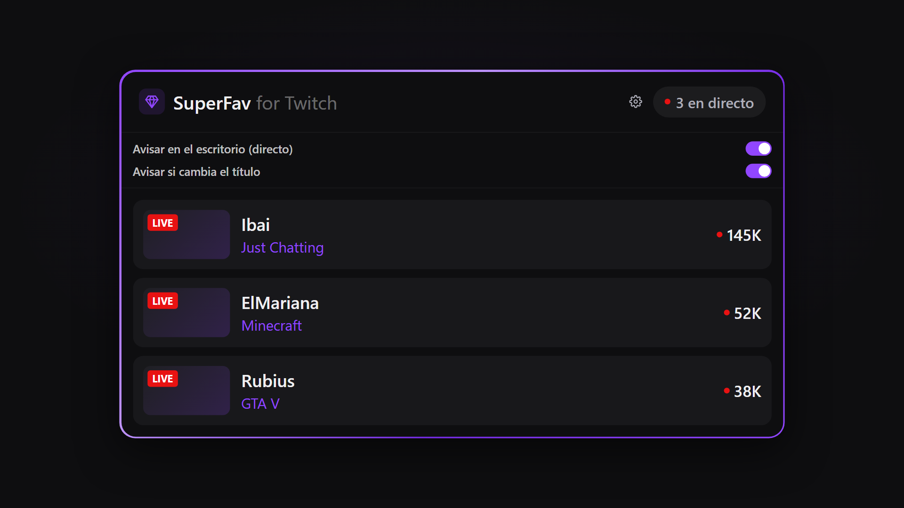
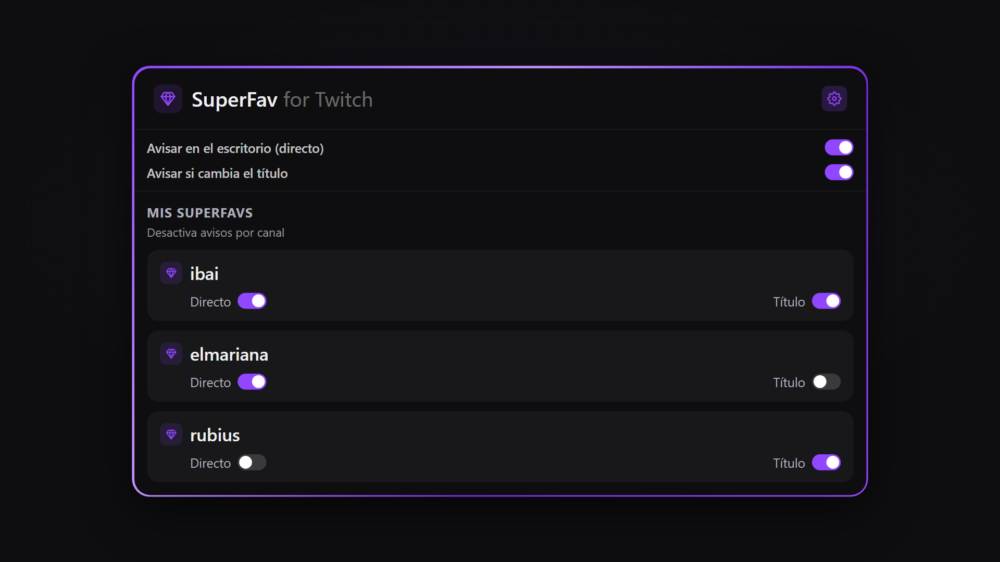
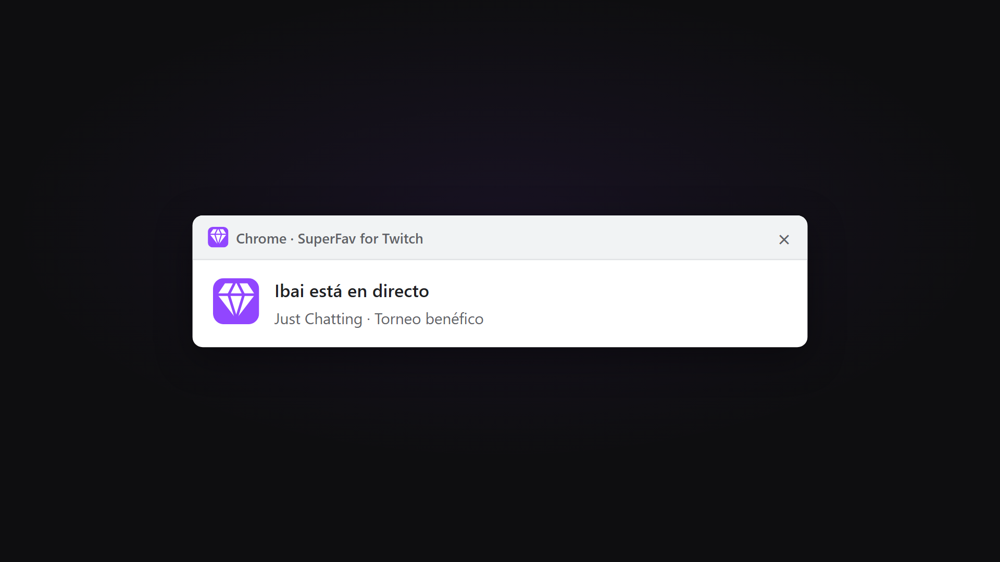
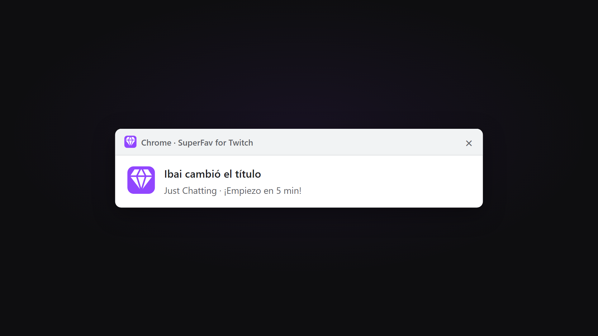

<p align="center">
  
</p>

<h1 align="center">💎 SuperFav for Twitch</h1>

<p align="center">
  <strong>Tus streamers favoritos, siempre a un clic.</strong><br/>
  Marca canales, mira quién está en directo y recibe avisos en el escritorio — sin tener Twitch abierto.
</p>

<p align="center">
  
  
  
</p>

<p align="center">
  🌐 <a href="https://superfavtwitch.onrender.com/">Web oficial</a>
  ·
  📦 <a href="https://github.com/zLeGnDz3r0/superfav-extension/releases/latest">Descargar release</a>
</p>

---

## ✨ ¿Qué es SuperFav?

**SuperFav** es una extensión gratuita para **Chrome** (y otros navegadores Chromium) que te permite marcar streamers de Twitch con un **botón de diamante** 💎 y enterarte al instante cuando entran en directo.

Olvídate de revisar manualmente cada canal: el **badge rojo** 🔴, el **popup** con la lista de directos y las **notificaciones de escritorio** 🖥️ hacen el trabajo por ti.

> 🔒 **Privado por diseño:** tus favoritos se guardan en *tu* navegador. No hay cuenta, no hay registro, no compartimos tu lista con nadie.

---

## 📸 Capturas

### Popup con toggles globales

Lista ordenada por espectadores, borde degradado y avisos globales siempre visibles.

<p align="center">
  
</p>

### ⚙️ Avisos por SuperFav

Desde el engranaje silencia **Directo** o **Título** canal a canal.

<p align="center">
  
</p>

### 🔔 Aviso de directo en el escritorio

Notificación del sistema cuando un SuperFav se conecta — aunque no tengas Twitch abierto.

<p align="center">
  
</p>

### 📝 Aviso de cambio de título

Te avisa si un streamer actualiza el título (revisión cada ~30 s).

<p align="center">
  
</p>

---

## 🚀 Funcionalidades

| | Feature | Descripción |
|---|---------|-------------|
| 💎 | **Un clic para marcar** | Pulsa el diamante en cualquier canal de Twitch para añadirlo a tus SuperFavs. |
| 🔴 | **Badge de directos** | Contador rojo en el icono. Se actualiza **cada 3 minutos**. |
| 🖥️ | **Avisos en el escritorio** | Notificación del sistema cuando un favorito empieza a emitir. Dura ~3 min. |
| 📋 | **Cambio de título** | Detecta cambios de título **cada 30 segundos**. |
| 📊 | **Popup al instante** | Quién emite, espectadores, categoría y miniatura. |
| ⚙️ | **Avisos por canal** | Engranaje → activa/silencia Directo y Título por SuperFav. |
| 🎚️ | **Toggles globales** | Siempre visibles; los individuales solo restringen más. |
| 🌓 | **Tema claro y oscuro** | El diamante se adapta al tema de Twitch. |
| 🔐 | **Local y seguro** | Favoritos en `chrome.storage`. Sin datos personales en servidores propios. |

---

## 🛠️ Instalación (modo desarrollador)

### Opción A — Desde el código fuente

```bash
git clone https://github.com/zLeGnDz3r0/superfav-extension.git
cd superfav-extension
npm install
npm run build
```

1. Abre `chrome://extensions`
2. Activa **Modo desarrollador**
3. **Cargar descomprimida** → selecciona la carpeta `dist/`

### Opción B — Desde un Release

1. Ve a **[Releases](https://github.com/zLeGnDz3r0/superfav-extension/releases)** y descarga el `.rar` / ZIP
2. Descomprímelo
3. En `chrome://extensions` → **Cargar descomprimida** → carpeta descomprimida

> 🏪 **Próximamente en Chrome Web Store** — instalación en un clic para todos.

---

## 🧭 Cómo usarla

1. **Instala** la extensión en Chrome, Edge o Brave
2. **Visita** un canal de Twitch y pulsa el **diamante** 💎
3. **Consulta** el badge 🔴, abre el **popup** o deja activos los **avisos de escritorio**
4. **Ajusta** los toggles globales; con el **engranaje** ⚙️ afina avisos por cada SuperFav

---

## 📋 Historial de versiones

### v1.1.0 — 18 jul 2026
- Avisos individuales por SuperFav (engranaje)
- Polling: directos cada 3 min, títulos cada 30 s
- Borde degradado del popup y mejor detección de título al ir live

### v1.0.0 — 14 jul 2026
- Primera versión pública: diamante, badge, popup, avisos de escritorio y de título

---

## 🏗️ Arquitectura (para curiosos)

```
Twitch (content script)  ──►  chrome.storage.sync  (tus SuperFavs, solo local)
                                    │
Popup / background  ──fetch──►  API pública  ──►  Twitch Helix
                                (sin secretos
                                 en la extensión)
```

La extensión **no incluye claves de Twitch**. Consulta directos y títulos a través de un proxy backend; tus favoritos **nunca salen de tu navegador** salvo los nombres de canal que envías en cada petición.

---

## 🌍 Compatibilidad

✅ Google Chrome · ✅ Microsoft Edge · ✅ Brave · ✅ Otros Chromium

---

## 📄 Licencia

Proyecto personal / uso comunitario. Consulta con el autor antes de redistribuir modificaciones.

---

<p align="center">
  Hecho con 💜 para la comunidad de Twitch<br/>
  <sub>© 2026 SuperFav for Twitch</sub>
</p>
